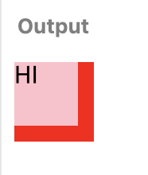
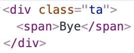
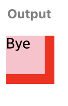
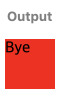

# DOM I


html에 있는 태그를 선택하는 방법

```js
//한개 - Element 반환
document.querySelector('.col');
document.getElementById('id'); //해당 요소의 아이디로 잡는 것

//여러개 - NodeList를 반환, 엘레먼트가 담겨있는 유사배열(.length, .forEach() 등 사용 가능)
document.querySelectorAll('.col');
document.getElementsByClassName('col'); //해당 요소의 클래스로 잡는 것
document.getElementsBytagName('p'); //해당 요소의 태그로 잡는 것
```


모든 element 에는 addEventListener 메소드가 존재한다.

[이벤트 타입 등 이벤트 관련 내용](https://developer.mozilla.org/en-US/docs/Web/Events) 은 MDN에 자세히 나와있으며 필요할 때 마다 확인해보면 좋을 듯 하다.

**`addEventListener`**

`parameter1` : event type : string

`parameter2` : event handler : func

event handler 에는 항상 event 라는 인자가 넘어온다.

공통적으로 event 객체에 항상 존재하는 `target` &&  `currentTarget` : Element

`target`  :  실제로 이벤트가 발생한 요소

`currentTarget`  : 이벤트가 등록되어 있는 요소

target 과 currentTarget 은 같아보이지만 전혀 다르다.

둘의 차이점을 알아보자.

```html
<style>
  .ta {
    width: 50px;
    height: 50px;
    background: red;
  }
  
  .ta span {
    display: block;
    width: 40px;
    height: 40px;
    background: pink;
  }
</style>

<div class="ta">
  <span>HI</span>
</div>
```


이런 코드가 있을 때,

```js
var $ta = document.querySelectorAll('.ta');

$ta.addEventListener('click', function (ev) {
  ev.target.textContent = 'Bye'; //span을 누르게 된다면 span을 클릭한 것으로 인식
  ev.currentTarget.textContent = 'Bye'; //span을 누르게 되어도 $ta로 이벤트를 등록했기 때문에 $ta를 클릭한 것으로 인식
});
```


||   

**이런 화면이 보여지는데 이때 pink색 영역(span)을 클릭하게 되었을 경우,**

* `ev.target` 으로 작성하게 되면 클릭된 영역의 태그가 들어온다.

   | ||   

  ```js
  console.log(ev.target) //<span>Bye</span>
  ```

  `<span>` 태그에 있던 "HI" 텍스트가" Bye"로 변경 된 것을 확인할 수 있다.


* `ev.currentTarget` 으로 작성하게 되면 이벤트가 등록되어있는 태그가 들어오게 된다.

  || |

```js
console.log(ev.currentTarget) //<div class="ta">Bye</div>
```

 안에있던 `<span>` 태그도 사라지고 `<div class="ta">` 안에 텍스트가 변경된 것을 확인 할 수 있다.


등록된 이벤트 요소에만 이벤트를 걸어야 하는 상황이라면 정확하게 `currentTarget` 을 사용하는 것이 좋다. 그러나 항상 currentTarget 만 사용해야 하는 것은 아니다. 클릭된 출처를 확인해야 하는 상황도 있을 수 있으므로 그런 경우는 (target)을 사용해야 한다.

