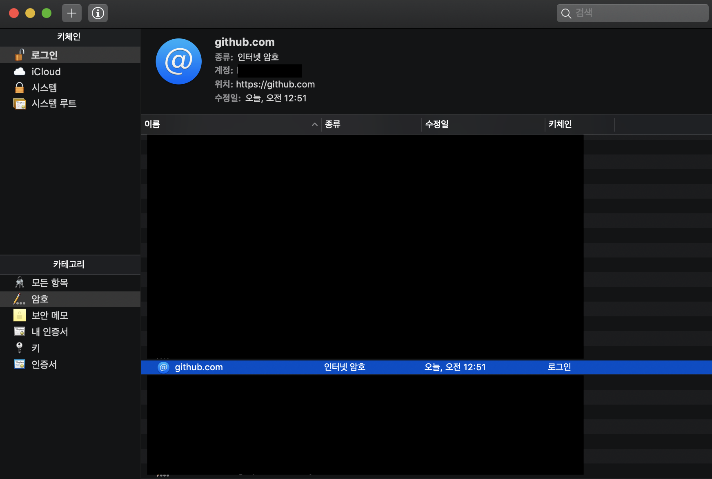
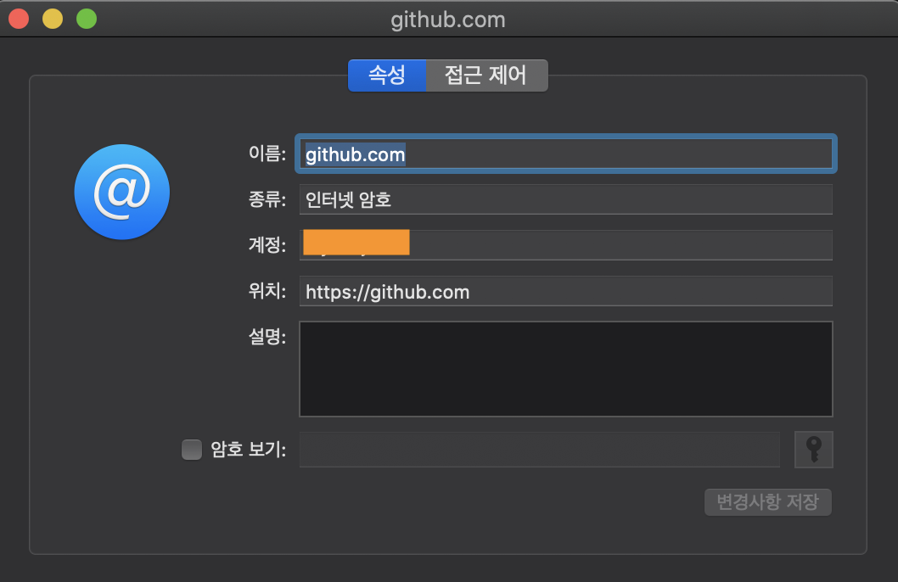
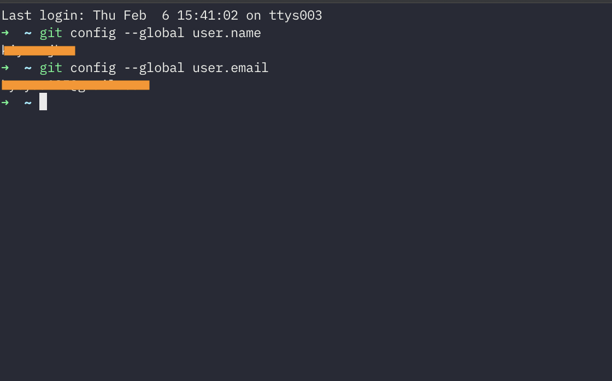

# 💡

## git error 

### git config --global user.name 변경 에러

**error를 만난 배경**

예전에 만든 github 아이디가 있었지만 아이디를 하나 더 만들어서 새롭게 시작하고 싶은 마음에 아이디 하나를 더 만들었다. 

repo를 만들고 clone하고..  첫 커밋을 하고 잔디가 이쁘게 심겼는지 확인 해보려 github 에 들어갔다.

당연히 새롭게 만든 아이디로 커밋이 된 줄 알았는데, 그 전에 만들어 두었던 아이디로 커밋이 되었다. 

검색을 해보니 처음 git 을 시작했을 때,

```bash
$ git config --global user.name
  처음 만들어 두었던 user.name
$ git config --global user.email
	처음 만들어 두었던 user.email
```

global 로 설정을 해서 그렇단다.

```bash
$ git config --local user.name "새로운 user.name"
$ git config --local user.email "새로운 user.email"
```

로 설정하게 되면 "그 디렉토리 안에서는 새로운 username 과 useremail 을 사용하겠다" 라는 뜻이다.

하지만, 나는 이제 새롭게 만든 github 계정으로 global 을 설정해서 사용하고싶다.

다시 검색해보자.

```bash
$ git config --global user.name "새로운 이름"
$ git config --global user.email "새로운 이메일"
```

로 하면 된다고 했지만,

```bash
error: could not lock config file C:/path/to/my/home/dir/.gitconfig: File exists
```

에러다.

에러 내용을 복사해서 검색 또 검색..

 그러다가 두가지 해결방법으로 도움이 되었는데, 

하나는 `sportlight`  에서  `keychain Access.app` 을 검색, 실행하면 많은 리스트가 나오는데 스크롤을 쭉내리면 



`gitHub.com` 을 클릭하면



그 전에 사용하던 계정이 나오는데 이걸 새로운 계정으로 변경해주고 암호 보기를 체크하면 비밀번호를 입력하라고 뜨는데 입력하고 나면 변경사항 저장이 활성화된다. 클릭! 하면 된다.

두번째는

> *Verify if there's some file called `~/.gitconfig.lock`. If that's the case just delete it.*

이런 답변을 종종 확인 하게 되어 .gitconfig.lock 이 있는지 확인해보니 있다.

처음엔 뭔가 삭제한다는게 두려웠지만, 너무 많은 시간을 썼던 터라 그냥 삭제해버렸다.

그리고 다시 

```bash
$ git config --global user.name "새로운계정"
$ git config --global user.email "새로운 이메일"
```

아무런 에러가 뜨지 않는다.



확인해보니 변경되었다.

새롭게 다시 커밋해보니 새로운 계정으로 커밋이 완료되었다.