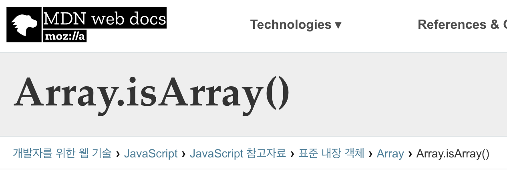
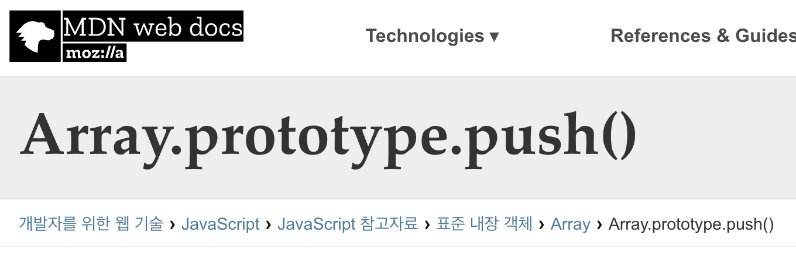
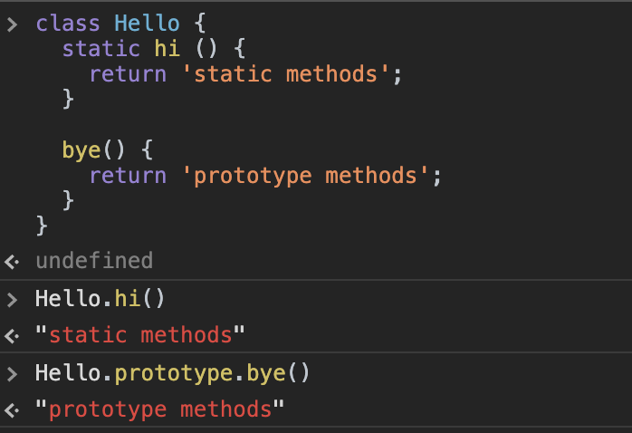
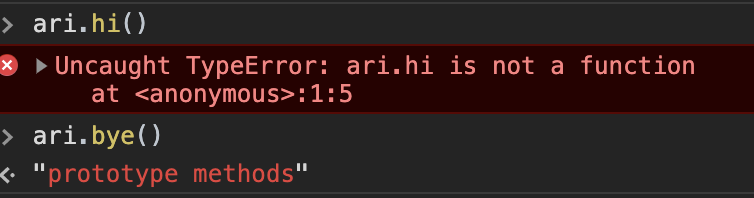

# ✏️

## Class

*계급, 집단, 집합 / 공통적인 속성을 모아놓은 덩어리*

*생성자 함수와 관련된 (prototype..) 것들을 하나의 클래스로 묶어둔 것*

```javascript
let a = new Array();
let b = [];
```

Array를 new 키워드로 생성할 수 있는 건, Array가 `생성자함수` 이기 때문이다.

```js
class Array {
  
}

또는,
  
function Array() {
  
}
```

Array를 하나의 class로 볼 수 있다.

위에서 선언한 변수 `a` , `b` 같은 것을 `instance` 라고 한다.

### static methods

그 중에서도 , Array 생성자함수 `객체 자체`에 선언된 함수들을 `static methods`라고 한다. 

```JavaScript
class Array {
  static from() {}
  static isArray() {}
}

또는,
  
Array.from = function () {
}
```

위와 같다고 볼 수 있다.

`arguments` , `length` 등과 같은 속성은 **static properties** 라고 한다.

우리가 배열을 선언해서 사용할 때 사용하는 `push()`, `pop()` 과 같은 메서드 들은 배열의 `prototype methods` 라고 할 수 있다.

```javascript
class Array {
  //...
  filter() {}
  push() {}
}

Array.prototype.push = function() {...}
```

MDN 에서도 Array 관련 메소드들을 검색해보면 확인이 가능하다.






새로운 class를 만들어서 확인해보자.



`instance` 를 만들어 인스턴스에서 constructor 자체에 선언한 함수에 접근이 가능 한지도 console로 쉽게 확인해볼 수 있다.




### Instance

위에서 확인 해 봤듯이, 

Instance 에서는 prototype chain 을 통해서 생성자 함수의 prototype에 접근해 사용가능하지만, 생성자함수 자체에 선언한 static 메소드들을 직접 사용 할 수 없다. 다만, 아래와 같이 우회해서 사용가능하다.

```javascript
CONSTRUCTOR; //생성자 함수 자체
CONSTRUCTOR.prototype.constructor; //다시 생성자 함수 본인을 지목한 것
Object.getPrototypeOf(instance).constructor;
instance.__proto__.constructor; //instance.__proto__는 constructor.prototype을 지목한 것이다
instance.constructor; //__proto__는 생략 가능하므로.
```

